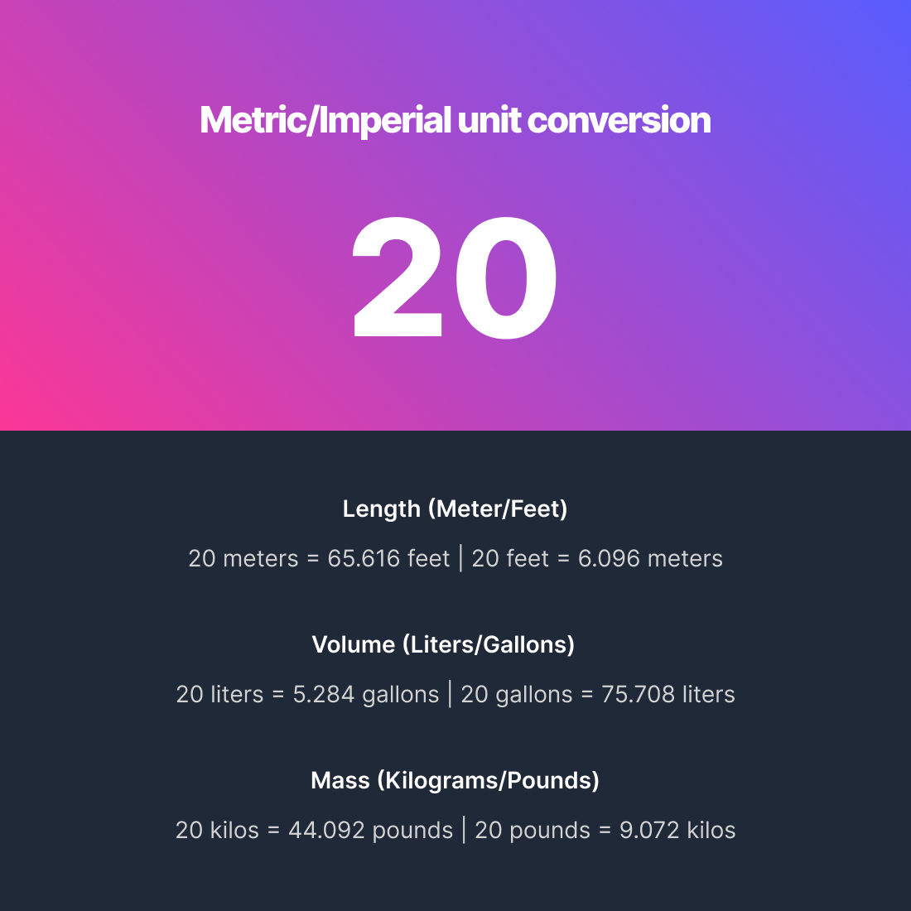
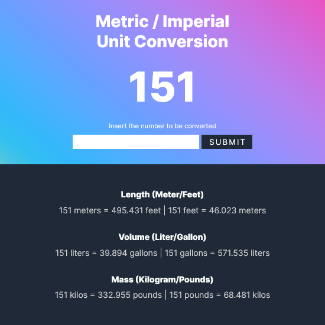
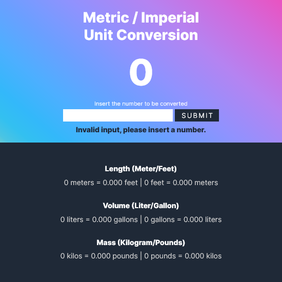

# The challenge

Build a Metric / Imperial unit conversion tool to simply convert a given value to all the equivalent conversions (like meters to feet and vice-versa) the results having only 3 decimal houses.

[Challenge Figma Project](https://www.figma.com/file/AdqUVRQCZGP1zRcEvzmJTm/Unit-Conversion?node-id=0%3A1)



# My Solution

**Link

- Live Site URL: [Live Site]()

**Screenshot





### My process

- HTML work, basing class/id names according to the BEM convention.
- CSS general layout
- Started writing the javascript code, this is where I decided to add the user input.
- Worked everything out to make sure the input typed was a number, and added an error message in case it wasn't.
- Made the typed number be shown at the header display and also on all of the starting values for the conversions, also made the error message change all the old values to 0.
- Made sure the code for the conversions and the displaying of the input number and the results were working accordingly.
- Worked on the rest of the CSS, including some effects and media queries.
- Testing and some small tweaks.

### Built with

- Semantic HTML5 markup
- CSS custom properties
- Flexbox
- Javascript
- [Sass](https://sass-lang.com/)
- [BEM](http://getbem.com/naming/)

### What I learned

- How to add a textContent to multiple elements with the same class
- Particularly happy about a piece of my code that added all formulae answers to an array and then used a for loop to get them, instead of getting each individual answer and adding one by one to an element in the HMTL by id
```
const answerArray = [meterToFeet, feetToMeter, literToGallon, gallonToLiter, kilosToPounds, poundsToKilos];
    
    for (let number in answerArray) {
        resultOutput[number].textContent = answerArray[number];
```

### Useful resources

- [MDN](https://developer.mozilla.org/en-US/) - Information on everything
- [Josh Comeau Gradient Generator](https://www.joshwcomeau.com/gradient-generator/) - Very good tool to get a good looking and easy to import background gradient
- [Google](https://www.google.com/) - For the conversion formulae and obviously, searching other stuff

### What I'm working on

- Learning more javascript fundamentals to then be able to not only learn but understand why I would need frameworks/libraries and which ones to choose first.
- Learning and applying more accessibility and SEO basics into my work.
- Understanding more of the concepts and basics of the Internet itself.
- Improving.
